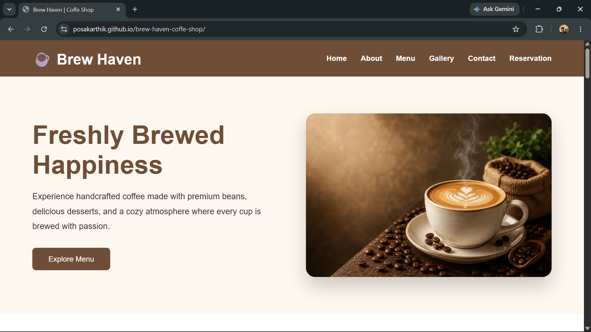

# ☕ Brew Haven Coffee Shop

A modern, responsive, and elegant multi-page coffee shop website built using **HTML5** and **CSS3**. Brew Haven showcases a clean user interface, responsive layouts, and a warm coffee-themed design, making it a great beginner-friendly frontend project.

---

## 🌐 Live Demo

🔗 https://posakarthik.github.io/Brew-Haven-Coffee-Shop/


---

## 📸 Preview

```md

```

---

## ✨ Features

- ☕ Modern coffee shop landing page
- 📄 Multi-page website
- 📱 Fully responsive design
- 🎨 Clean and attractive UI
- 🖼️ Coffee gallery
- 🍽️ Menu page
- 📞 Contact page
- 📅 Reservation page
- 🌟 Hover effects and transitions
- 🧭 Easy navigation

---

## 🛠️ Tech Stack

- HTML5
- CSS3
- Flexbox
- CSS Grid
- Responsive Design (Media Queries)
- Font Awesome
- Git
- GitHub
- GitHub Pages

---

## 📂 Project Structure

```text
brew-haven-coffee-shop/
│
├── css/
│   ├── style.css
│   └── responsive.css
│
├── images/
│
├── index.html
├── about.html
├── menu.html
├── gallery.html
├── contact.html
├── reservation.html
│
└── README.md
```

---

## 🚀 Getting Started

Clone the repository

```bash
git clone https://github.com/PosaKarthik/Brew-Haven-Coffee-Shop.git
```

Navigate to the project

```bash
cd Brew-Haven-Coffee-Shop
```

Open `index.html` in your browser.

---

## 📚 What I Learned

- Semantic HTML5
- CSS3 fundamentals
- Flexbox
- CSS Grid
- Responsive Web Design
- Multi-page website development
- Git & GitHub workflow
- GitHub Pages deployment

---

## 🔮 Future Improvements

- JavaScript interactions
- Hamburger menu
- Dark mode
- Form validation
- Smooth scrolling
- Animations

---

## 👨‍💻 Author

**Posa Karthik**

- GitHub: https://github.com/PosaKarthik
- LinkedIn: https://www.linkedin.com/in/posa-karthik-225353408/

---
